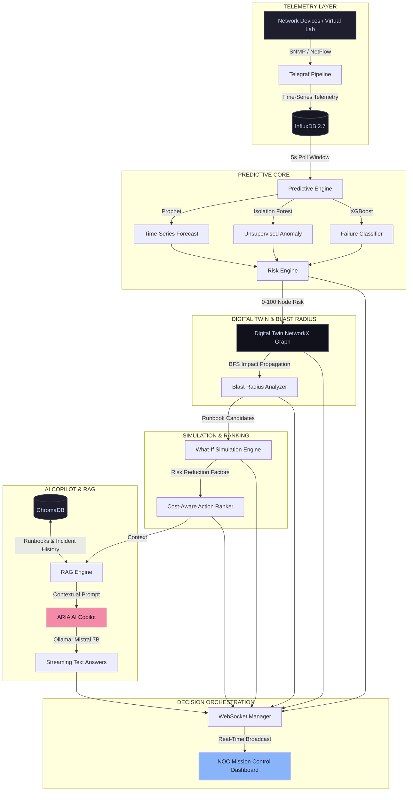

# VIKRAM
Air-Gapped Predictive Copilot for Secure MPLS Operations

[]()
[]()
[]()
[]()

An offline, **AI-powered Network Operations Center (NOC) Mission Control** built for secure, enterprise-grade MPLS & SD-WAN networks. It predicts failures before service impact, explains risk propagation, simulates corrective actions, and answers complex operator questions—running **100% locally** in an air-gapped environment.

---

## 🗺️ Architectural Topology & Data Pipeline

The diagram below outlines the secure, closed-loop telemetry and decision intelligence pipeline:



---

## ⚡ Core Features

### 💻 Live Digital Twin
* Renders real-time topological graphs using **React Flow** and **Framer Motion**.
* Visually highlights MPLS paths, spoke routers, control links, and active traffic loads.
* Tracks live metrics (CPU, bandwidth utilization, latency, packet loss, jitter) with HSL tailored color states.

### 🔮 Real-Time Predictive Loop
* **Prophet Forecasting:** Predicts trend changes and time-to-impact (TTI) for nodes.
* **Isolation Forest:** Automatically detects multi-metric anomaly signatures.
* **XGBoost Classifier:** Pinpoints root causes (e.g., Congestion, BGP Session Flaps, Tunnel Degradation).

### 📐 Blast Radius & Simulation
* Runs failure propagation waves from any network node using BFS traversal.
* Runs **What-If Simulations** to preview how topology risk scores adjust *before* executing changes.
* Automatically scores and ranks runbook recovery procedures.

### 🤖 Local RAG & ARIA Copilot
* Local vector database (ChromaDB + BGE-Small) stores incident reports, runbooks, and manuals.
* ARIA (AI Copilot) streams replies using SSE and an offline **Mistral 7B** model.
* Zero external API calls—ensures absolute confidentiality of network architecture.

---

## 🚀 Local Device Setup (Easiest Way Possible)

### 📋 Prerequisites & Step 0: Install & Configure Docker

Before setting up the project, you must have Docker running on your device:

#### 1. Install Docker
* **Windows & macOS (Recommended):** Download and install [Docker Desktop](https://www.docker.com/products/docker-desktop/).
  * *Windows Tip:* During installation, ensure the **WSL 2 backend** option is checked for maximum performance.
* **Linux:** Install Docker Engine and Compose using your package manager:
  ```bash
  # Quick installation script for Linux
  curl -fsSL https://get.docker.com -o get-docker.sh
  sudo sh get-docker.sh
  sudo usermod -aG docker $USER  # Log out and log back in for groups to apply
  ```

#### 2. Allocate System Resources (Crucial for Running AI Models)
Since the AI Copilot runs a 7-Billion parameter LLM offline on your machine:
* Open **Docker Desktop Settings** -> **Resources**.
* Ensure Docker has access to at least **4 CPU Cores** and **8GB of RAM** (12GB+ recommended if available).
* If using Windows WSL2 backend, ensure your `%USERPROFILE%\.wslconfig` allocates sufficient memory (e.g., `memory=12GB`).

#### 3. Verify Docker is Running
Open a terminal and verify:
```bash
docker --version
docker compose version
docker ps  # Should not return a daemon connection error
```

---

### 💻 Options 1: One-Command Setup (Linux & macOS / WSL / Git Bash)

Clone the repository and run the setup script:
```bash
git clone <your-repo-url> ps13-copilot
cd ps13-copilot
bash scripts/setup.sh
```
This script automates environment variable creation, initializes the databases, pulls the Mistral 7B LLM model inside Ollama, runs migrations, and seeds the telemetry data.

---

### 🪟 Option 2: Step-by-Step Local Setup (Windows PowerShell / Manual Setup)

If you are on Windows PowerShell or prefer manual control, follow these steps:

#### Step 1: Clone the Repo & Set Up `.env`
```powershell
git clone <your-repo-url> ps13-copilot
cd ps13-copilot
copy .env.example .env
```
Open `.env` in your editor and ensure `SECRET_KEY` and other parameters are filled (the default placeholders are fine for local development).

#### Step 2: Spin Up Infrastructure Containers
Start the Postgres database, InfluxDB telemetry DB, ChromaDB vector store, and Ollama server:
```powershell
docker compose up -d postgres influxdb chromadb ollama
```

#### Step 3: Pull the AI Model
Once the containers are running, pull the local Mistral LLM model inside the Ollama container:
```powershell
docker exec -it ps13-ollama ollama pull mistral:7b-instruct
```
*(Optional: If you want a smaller/faster fallback model, you can run `docker exec -it ps13-ollama ollama pull phi3:mini` instead and configure it in `.env`)*

#### Step 4: Run the Complete App Stack
Build and spin up the frontend, backend, telemetry collectors, and monitoring services:
```powershell
docker compose up -d --build
```

#### Step 5: Seed Demo Telemetry & Runbooks
Inject the baseline historical metrics, incident databases, and runbook definitions:
```powershell
docker compose run --rm init
```

---

## 🌐 Dashboard Access Points

Once everything is up, open these ports in your browser:

| Application / Service | URL | Credentials (Default) |
|---|---|---|
| **PS13 NOC Dashboard** | [http://localhost:3000](http://localhost:3000) | *No Auth needed (Dev Mode)* |
| **Backend Swagger API Docs** | [http://localhost:8000/docs](http://localhost:8000/docs) | *Interactive UI* |
| **Prometheus Monitor** | [http://localhost:9090](http://localhost:9090) | *Metrics Scraper* |
| **Grafana Dashboards** | [http://localhost:3001](http://localhost:3001) | `admin` / `admin` |
| **InfluxDB Admin Console** | [http://localhost:8086](http://localhost:8086) | `admin` / `influxadmin` |

---

## 🧪 Demo Fault Injection Scenarios

You can trigger network anomalies directly from the NOC interface under the **Scenarios** tab, or test the backend API using these copy-pasteable commands:

### Scenario 1: progressive Hub Router Congestion
```bash
# Inject progressively (step by step)
curl -X POST http://localhost:8000/api/scenarios/HUB_CONGESTION/inject

# Jump straight to maximum severity
curl -X POST http://localhost:8000/api/scenarios/HUB_CONGESTION/full
```

### Scenario 2: BGP Routing Protocol Flapping
```bash
curl -X POST http://localhost:8000/api/scenarios/BGP_ROUTE_FLAP/full
```

### Scenario 3: Last-Mile IPSec Tunnel Degradation
```bash
curl -X POST http://localhost:8000/api/scenarios/TUNNEL_DEGRADATION/full
```

### Scenario 4: MPLS LSP Label Collapse
```bash
curl -X POST http://localhost:8000/api/scenarios/MPLS_FAILURE/full
```

### Scenario 5: SD-WAN Configuration Drift (VoIP QoS Degradation)
```bash
curl -X POST http://localhost:8000/api/scenarios/POLICY_DRIFT/full
```

### Clear All Anomalies (Restore Network to Baseline)
```bash
curl -X POST http://localhost:8000/api/scenarios/reset
```

---

## 🛠️ Makefile Commands & Shortcuts

A pre-configured [Makefile](file:///c:/Users/ajink/Desktop/ps13-copilot/Makefile) includes practical shortcuts:

```bash
make up                 # Start all services
make down               # Stop all services
make logs               # Stream docker logs
make seed               # Re-seed baseline demo data
make reset              # Clear all active scenarios
make health             # Run diagnostics checks
make test               # Run backend unit tests
```

---

## 🔧 Troubleshooting & Known Gotchas

Here is how we resolved common environment issues during development:

### 🔴 Ollama Healthcheck reports "unhealthy" in Docker
* **Issue:** The base `ollama` image does not come with `curl` pre-installed, causing default curl healthchecks to fail.
* **Resolution:** We changed the health check command to use Ollama's own CLI: `test: ["CMD", "ollama", "list"]` in `docker-compose.yml`. This correctly reports the service state.

### 🔴 Prophet `AttributeError: 'Prophet' object has no attribute 'stan_backend'`
* **Issue:** In offline environments, Python's `cmdstanpy` library fails validation checks because the pre-packaged Prophet installation doesn't ship with a CmdStan compilation `makefile`.
* **Resolution:** We added a step in the [Dockerfile](file:///c:/Users/ajink/Desktop/ps13-copilot/backend/Dockerfile) to `touch` a dummy makefile inside the package directory, bypassing compilation requirements and restoring Prophet's linear forecasting capabilities.

### 🔴 IDE showing red lines / imports missing in VS Code or Cursor
* **Issue:** Typescript cannot find modules (`react`, `@xyflow/react`) inside the `frontend` folder because the dependencies were only installed inside the container.
* **Resolution:** Navigate to the `frontend` folder on your host machine and run:
  ```bash
  cd frontend
  npm install
  ```
  This creates the host `node_modules` and resolves all typescript warnings.

---

## 📁 Repository Layout

```
ps13-copilot/
├── backend/
│   ├── main.py                          # FastAPI Application Entrypoint
│   ├── config.py                        # Pydantic Settings & Tuning Parameters
│   ├── database.py                      # DB connection (SQLAlchemy + InfluxDB)
│   ├── core/
│   │   ├── orchestrator.py              # Background polling & prediction task loop
│   │   └── websocket_manager.py         # Live websocket connections and broadcast
│   └── services/
│       ├── digital_twin/twin.py         # NetworkX Topology & Path Routing
│       ├── prediction/predictor.py      # Prophet + IForest + XGBoost pipelines
│       ├── risk/risk_engine.py          # Node risk calculation heuristics
│       ├── blast_radius/analyzer.py     # BFS failure wave propagation
│       ├── simulation/counterfactual.py # What-if runbook simulation engine
│       ├── action_ranking/ranker.py     # Cost/Efficiency Action Ranker
│       ├── rag/rag_engine.py            # Local ChromaDB Vector Store & Query
│       └── copilot/copilot.py           # Ollama Mistral 7B Interface
├── frontend/
│   ├── src/
│   │   ├── app/                         # Next.js 15 App Layouts
│   │   ├── components/                  # Canvas, AI panel, charts, alerts
│   │   └── store/index.ts               # Zustand global store manager
├── data/
│   ├── runbooks/                        # Target .md runbooks for RAG indexing
│   └── generate_demo_data.py            # Seed script for historical data
├── infra/                               # Configuration for Prometheus/Telegraf
└── scripts/                             # Host scripts for setup and health checks
```

---

*PS13 Mission Control — Secure. Local. Autonomous. Predictive.*
