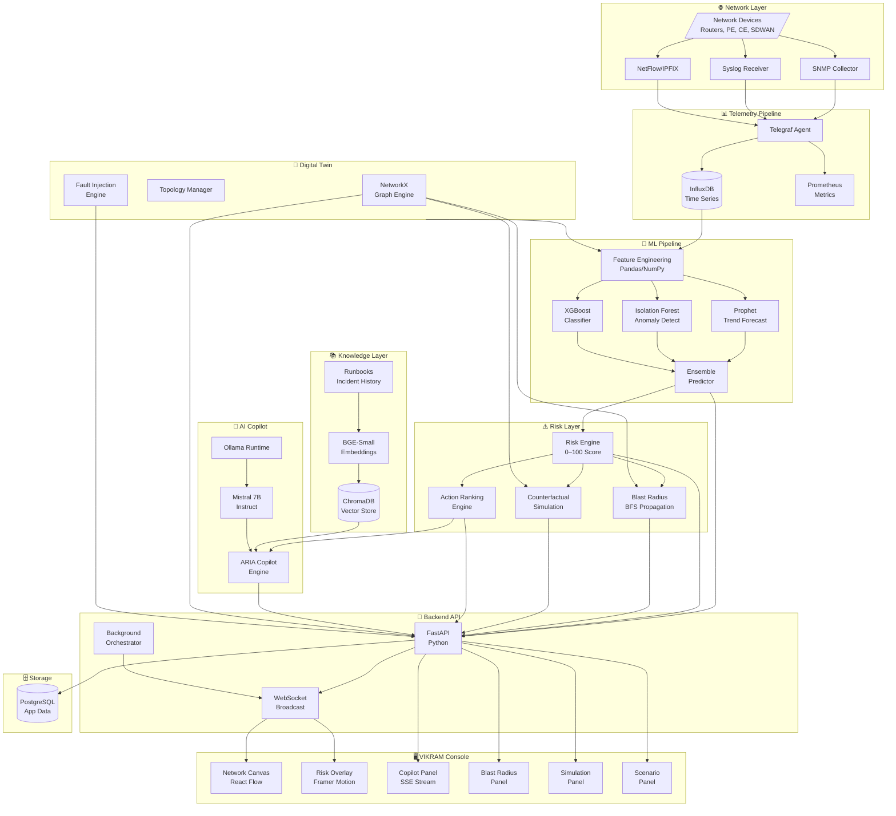
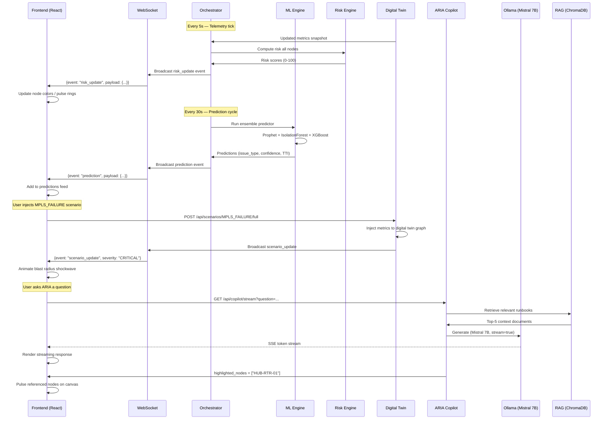
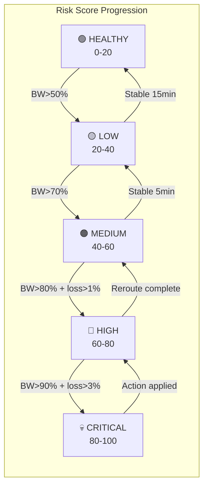

```mermaid
flowchart TD
    subgraph NETWORK["🌐 Network Layer"]
        DEV[/"Network Devices\nRouters, PE, CE, SDWAN"/]
        SNMP[SNMP Collector]
        SYSLOG[Syslog Receiver]
        NETFLOW[NetFlow/IPFIX]
    end

    subgraph TELEMETRY["📊 Telemetry Pipeline"]
        TELEGRAF[Telegraf Agent]
        INFLUX[(InfluxDB\nTime Series)]
        PROM[Prometheus\nMetrics]
    end

    subgraph TWIN["🔮 Digital Twin"]
        GRAPH[NetworkX\nGraph Engine]
        TOPO[Topology Manager]
        FAULT[Fault Injection\nEngine]
    end

    subgraph ML["🧠 ML Pipeline"]
        FEAT[Feature Engineering\nPandas/NumPy]
        PROPHET[Prophet\nTrend Forecast]
        IFOREST[Isolation Forest\nAnomaly Detect]
        XGBOOST[XGBoost\nClassifier]
        ENSEMBLE[Ensemble\nPredictor]
    end

    subgraph RISK["⚠️ Risk Layer"]
        RISKENG[Risk Engine\n0–100 Score]
        BLAST[Blast Radius\nBFS Propagation]
        COUNTER[Counterfactual\nSimulation]
        RANKER[Action Ranking\nEngine]
    end

    subgraph RAG["📚 Knowledge Layer"]
        CHROMA[(ChromaDB\nVector Store)]
        EMBED[BGE-Small\nEmbeddings]
        RUNBOOKS[Runbooks\nIncident History]
    end

    subgraph COPILOT["🤖 AI Copilot"]
        OLLAMA[Ollama Runtime]
        MISTRAL[Mistral 7B\nInstruct]
        ARIA[ARIA Copilot\nEngine]
    end

    subgraph API["🔌 Backend API"]
        FASTAPI[FastAPI\nPython]
        WS[WebSocket\nBroadcast]
        ORCH[Background\nOrchestrator]
    end

    subgraph FRONTEND["🖥️ VIKRAM Console"]
        CANVAS[Network Canvas\nReact Flow]
        RISKUI[Risk Overlay\nFramer Motion]
        COPILOTUI[Copilot Panel\nSSE Stream]
        BLASTUI[Blast Radius\nPanel]
        SIMUI[Simulation\nPanel]
        SCENUI[Scenario\nPanel]
    end

    subgraph DB["🗄️ Storage"]
        PG[(PostgreSQL\nApp Data)]
    end

    DEV --> SNMP --> TELEGRAF
    DEV --> SYSLOG --> TELEGRAF
    DEV --> NETFLOW --> TELEGRAF
    TELEGRAF --> INFLUX
    TELEGRAF --> PROM

    INFLUX --> FEAT
    TWIN --> FEAT
    FEAT --> PROPHET
    FEAT --> IFOREST
    FEAT --> XGBOOST
    PROPHET & IFOREST & XGBOOST --> ENSEMBLE

    ENSEMBLE --> RISKENG
    RISKENG --> BLAST
    RISKENG --> COUNTER
    RISKENG --> RANKER
    GRAPH --> BLAST
    GRAPH --> COUNTER
    RANKER --> ARIA

    RUNBOOKS --> EMBED --> CHROMA
    CHROMA --> ARIA
    OLLAMA --> MISTRAL --> ARIA

    ENSEMBLE --> FASTAPI
    RISKENG --> FASTAPI
    BLAST --> FASTAPI
    COUNTER --> FASTAPI
    RANKER --> FASTAPI
    ARIA --> FASTAPI
    GRAPH --> FASTAPI
    FAULT --> FASTAPI

    FASTAPI --> WS
    FASTAPI --> PG
    ORCH --> WS

    WS --> CANVAS
    WS --> RISKUI
    FASTAPI --> COPILOTUI
    FASTAPI --> BLASTUI
    FASTAPI --> SIMUI
    FASTAPI --> SCENUI
```

```mermaid
sequenceDiagram
    participant FE as Frontend (React)
    participant WS as WebSocket
    participant ORCH as Orchestrator
    participant ML as ML Engine
    participant RISK as Risk Engine
    participant TWIN as Digital Twin
    participant COPILOT as ARIA Copilot
    participant OLLAMA as Ollama (Mistral 7B)
    participant RAG as RAG (ChromaDB)

    Note over ORCH: Every 5s — Telemetry tick
    TWIN->>ORCH: Updated metrics snapshot
    ORCH->>RISK: Compute risk all nodes
    RISK->>ORCH: Risk scores (0-100)
    ORCH->>WS: Broadcast risk_update event
    WS->>FE: {event: "risk_update", payload: {...}}
    FE->>FE: Update node colors / pulse rings

    Note over ORCH: Every 30s — Prediction cycle
    ORCH->>ML: Run ensemble predictor
    ML->>ML: Prophet + IsolationForest + XGBoost
    ML->>ORCH: Predictions (issue_type, confidence, TTI)
    ORCH->>WS: Broadcast prediction event
    WS->>FE: {event: "prediction", payload: {...}}
    FE->>FE: Add to predictions feed

    Note over FE: User injects MPLS_FAILURE scenario
    FE->>TWIN: POST /api/scenarios/MPLS_FAILURE/full
    TWIN->>TWIN: Inject metrics to digital twin graph
    TWIN->>WS: Broadcast scenario_update
    WS->>FE: {event: "scenario_update", severity: "CRITICAL"}
    FE->>FE: Animate blast radius shockwave

    Note over FE: User asks ARIA a question
    FE->>COPILOT: GET /api/copilot/stream?question=...
    COPILOT->>RAG: Retrieve relevant runbooks
    RAG->>COPILOT: Top-5 context documents
    COPILOT->>OLLAMA: Generate (Mistral 7B, stream=true)
    OLLAMA-->>FE: SSE token stream
    FE->>FE: Render streaming response
    COPILOT->>FE: highlighted_nodes = ["HUB-RTR-01"]
    FE->>FE: Pulse referenced nodes on canvas
```

```mermaid
graph LR
    subgraph RISK_LEVELS["Risk Score Progression"]
        H["🟢 HEALTHY\n0-20"]
        L["🟡 LOW\n20-40"]
        M["🟠 MEDIUM\n40-60"]
        HI["🔴 HIGH\n60-80"]
        C["💀 CRITICAL\n80-100"]
    end

    H -->|"BW>50%"| L
    L -->|"BW>70%"| M
    M -->|"BW>80% + loss>1%"| HI
    HI -->|"BW>90% + loss>3%"| C
    C -->|"Action applied"| HI
    HI -->|"Reroute complete"| M
    M -->|"Stable 5min"| L
    L -->|"Stable 15min"| H
```
